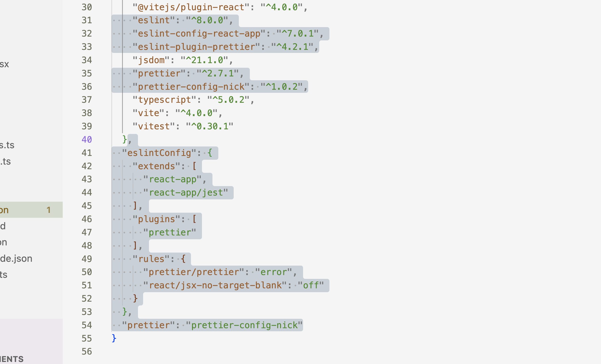

# Инструкция по настройке eslint и prettier в вашем проекте, на примере vite, стили от airbnb

Предпосылки: мы создали проект RTK c vite при помощи команды:

```
npx degit reduxjs/redux-templates/packages/vite-template-redux my-app
```

1. Если вы уже устанавливали node_modules - удалите папку node_modules
2. Теперь очистим проект от предшествующих настроек. Удалите из в `package.json` devDependencies - все связанное с eslint и prettier 



Теперь ваш файл выглядит примерно вот так

```json
{
"name": "vite-template-redux",
"private": true,
"version": "0.0.0",
"type": "module",
"scripts": {
"dev": "vite",
"start": "vite",
"build": "tsc && vite build",
"preview": "vite preview",
"test": "vitest",
"format": "prettier --write .",
"lint": "eslint .",
"type-check": "tsc"
},
"dependencies": {
"@reduxjs/toolkit": "^1.8.1",
"react": "^18.2.0",
"react-dom": "^18.2.0",
"react-redux": "^8.0.1"
},
"devDependencies": {
"@testing-library/dom": "^9.2.0",
"@testing-library/jest-dom": "^5.11.4",
"@testing-library/react": "^14.0.0",
"@testing-library/user-event": "^14.2.5",
"@types/react": "^18.0.15",
"@types/react-dom": "^18.0.6",
"@types/testing-library__jest-dom": "^5.14.5",
"@vitejs/plugin-react": "^4.0.0",
"jsdom": "^21.1.0",
"typescript": "^5.0.2",
"vite": "^4.0.0",
"vitest": "^0.30.1"
}
```

3. Установим модули: `npm i`
4. Установим зависимости eslint и prettier:

```
npm i -D @typescript-eslint/eslint-plugin@^5.13.0 @typescript-eslint/parser@^5.0.0 eslint@^8.24.0 eslint-config-airbnb@^19.0.4 eslint-config-airbnb-typescript@^17.0.0 eslint-config-prettier@^8.5.0 eslint-import-resolver-typescript@^3.5.1 eslint-plugin-import@^2.26.0 eslint-plugin-jsx-a11y@^6.6.1 eslint-plugin-prettier@^4.2.1 eslint-plugin-react@^7.31.8 eslint-plugin-react-hooks@^4.6.0 prettier@^2.7.1
```

После установки ваш 'package.json' выглядит примерно вот так:

```
{
"name": "vite-template-redux",
"private": true,
"version": "0.0.0",
"type": "module",
"scripts": {
"dev": "vite",
"start": "vite",
"build": "tsc && vite build",
"preview": "vite preview",
"test": "vitest",
"format": "prettier --write .",
"lint": "eslint .",
"type-check": "tsc"
},
"dependencies": {
"@reduxjs/toolkit": "^1.8.1",
"react": "^18.2.0",
"react-dom": "^18.2.0",
"react-redux": "^8.0.1"
},
"devDependencies": {
"@testing-library/dom": "^9.2.0",
"@testing-library/jest-dom": "^5.11.4",
"@testing-library/react": "^14.0.0",
"@testing-library/user-event": "^14.2.5",
"@types/react": "^18.0.15",
"@types/react-dom": "^18.0.6",
"@types/testing-library\_\_jest-dom": "^5.14.5",
"@typescript-eslint/eslint-plugin": "^5.62.0",
"@typescript-eslint/parser": "^5.62.0",
"@vitejs/plugin-react": "^4.0.0",
"eslint": "^8.46.0",
"eslint-config-airbnb": "^19.0.4",
"eslint-config-airbnb-typescript": "^17.1.0",
"eslint-config-prettier": "^8.10.0",
"eslint-import-resolver-typescript": "^3.5.5",
"eslint-plugin-import": "^2.28.0",
"eslint-plugin-jsx-a11y": "^6.7.1",
"eslint-plugin-prettier": "^4.2.1",
"eslint-plugin-react": "^7.33.1",
"eslint-plugin-react-hooks": "^4.6.0",
"jsdom": "^21.1.0",
"prettier": "^2.8.8",
"typescript": "^5.0.2",
"vite": "^4.0.0",
"vitest": "^0.30.1"
}
}
```

5. В корневой папке проекта (это рядом с package.json) создадим файл:

```
.eslintrc.json
``` 
6. Вставим в него следующий код:
```json
{
"env": {
"browser": true,
"es6": true
},
"extends": [
"eslint:recommended",
"airbnb/hooks",
"airbnb-typescript",
"plugin:react/recommended",
"plugin:react/jsx-runtime",
"plugin:@typescript-eslint/recommended",
"plugin:@typescript-eslint/recommended-requiring-type-checking",
"plugin:prettier/recommended",
"plugin:import/recommended"
],
// Specifying Parser
"parser": "@typescript-eslint/parser",
"parserOptions": {
"ecmaFeatures": {
"jsx": true
},
"ecmaVersion": "latest",
"sourceType": "module",
"tsconfigRootDir": ".",
"project": [
"./tsconfig.json"
]
},
// Configuring third-party plugins
"plugins": [
"react",
"@typescript-eslint"
],
// Resolve imports
"settings": {
"import/resolver": {
"typescript": {
"project": "./tsconfig.json"
}
},
"react": {
"version": "18.x"
}
},
"rules": {
"linebreak-style": "off",
// Configure prettier
"prettier/prettier": [
"error",
{
"printWidth": 100,
"endOfLine": "lf",
"singleQuote": true,
"tabWidth": 2,
"indentStyle": "space",
"useTabs": true,
"trailingComma": "es5"
}
],
// Disallow the `any` type.
"@typescript-eslint/no-explicit-any": "warn",
"@typescript-eslint/ban-types": [
"error",
{
"extendDefaults": true,
"types": {
"{}": false
}
}
],
"react-hooks/exhaustive-deps": "off",
// Enforce the use of the shorthand syntax.
"object-shorthand": "error",
"no-console": "warn",
"@typescript-eslint/no-floating-promises": "off",
		"@typescript-eslint/no-misused-promises": "off",
		"@typescript-eslint/no-unsafe-return": "off",
		"@typescript-eslint/no-unsafe-assignment": "off",
		"react/jsx-indent": 0,
		"implicit-arrow-linebreak": 0,
		"@typescript-eslint/indent": 0,
		"@typescript-eslint/comma-dangle": 0,
		"function-paren-newline": 0,
		"no-param-reassign": 0,
		"no-nested-ternary": 0,
		"no-confusing-arrow": 0,
		"operator-linebreak": 0,
		"jsx-a11y/anchor-is-valid": 0,
		"jsx-a11y/label-has-associated-control": 0,
		"react/jsx-one-expression-per-line": 0,
		"jsx-a11y/click-events-have-key-events": 0,
		"default-case": 0,
		"@typescript-eslint/default-param-last": 0,
		"@typescript-eslint/switch-exhaustiveness-check": 2,
		"@typescript-eslint/explicit-function-return-type": [
			2,
			{
				"allowExpressions": true,
				"allowTypedFunctionExpressions": true,
				"allowHigherOrderFunctions": true,
				"allowDirectConstAssertionInArrowFunctions": true
			}
		]
}
}
```

7. Теперь обновим соответвующие команды скриптов в ``package.json`` на:
```
"lint": "tsc --noEmit && eslint src/**/*.ts{,x} --cache --max-warnings=0",
"lint:fix": "eslint src/**/*.ts{,x} --fix",
```
Скрипты после изменения выглядят примерно вот так:
```
  "scripts": {
    "dev": "vite",
    "start": "vite",
    "build": "tsc && vite build",
    "preview": "vite preview",
    "test": "vitest",
    "lint": "tsc --noEmit && eslint src/**/*.ts{,x} --cache --max-warnings=0",
    "lint:fix": "eslint src/**/*.ts{,x} --fix",
    "type-check": "tsc"
  },
```
8. Если вы еще не устанавливали расширения для vscode:
```Prettier - Code formatter``` и  ```ESLint``` сделайте это. (в левом меню - значек "extensions")

9. Последнее действие. Добавьте в корень проекта файл с настройками vscode:
```.vscode/settings.json```
И поместите в него следующий код: 
```
{
    "editor.formatOnSave": true,
    "editor.defaultFormatter": "esbenp.prettier-vscode",
    "prettier.trailingComma": "es5",
    "prettier.requireConfig": false,
    "prettier.singleQuote": true,
    "prettier.useTabs": true,
    "prettier.tabWidth": 2,
    "prettier.printWidth": 100,
    "editor.tabSize": 2,
    "editor.codeActionsOnSave": [
        "source.formatDocument",
        "source.fixAll.eslint"
    ],
}
```
## Итого 
Теперь у вас должны подсвечиваться ошибки. 
Если вы нажмете на windows:``cntrl s`` или на мас: ``commmand s`` - это команда сохранить файл, то файл автоматически отредактируется в согласии со стилями. 

Также имеется две команды для терминала (мы прописали для них скрипты выше): 
- ```npm run lint``` - чтобы линт проверил проект и подсветил все ошибки
- ```npm run lint:fix``` - чтобы он исправил все что может самостоятельно исправить
